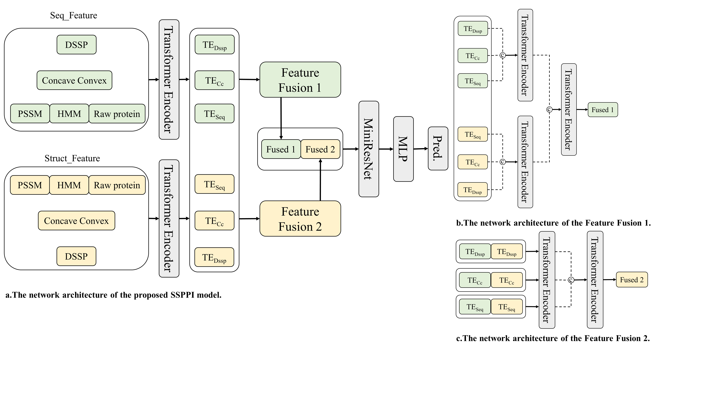

# SSPPI
"compute_concave_convex": Calculating protein surface concave and convex features.  
"SSPPI_Ensemble": _SSPPI_(Sequence and Structure feature-based protein-protein interaction site prediction). An ensemble model based on multiple local features.  

The figure shows the model architecture of SSPPI. We construct the proteins' local feature by two different approaches.  
1:uses only sliding windows on protein sequence to construct local features  
2:uses only spatial distances to construct local features

 
